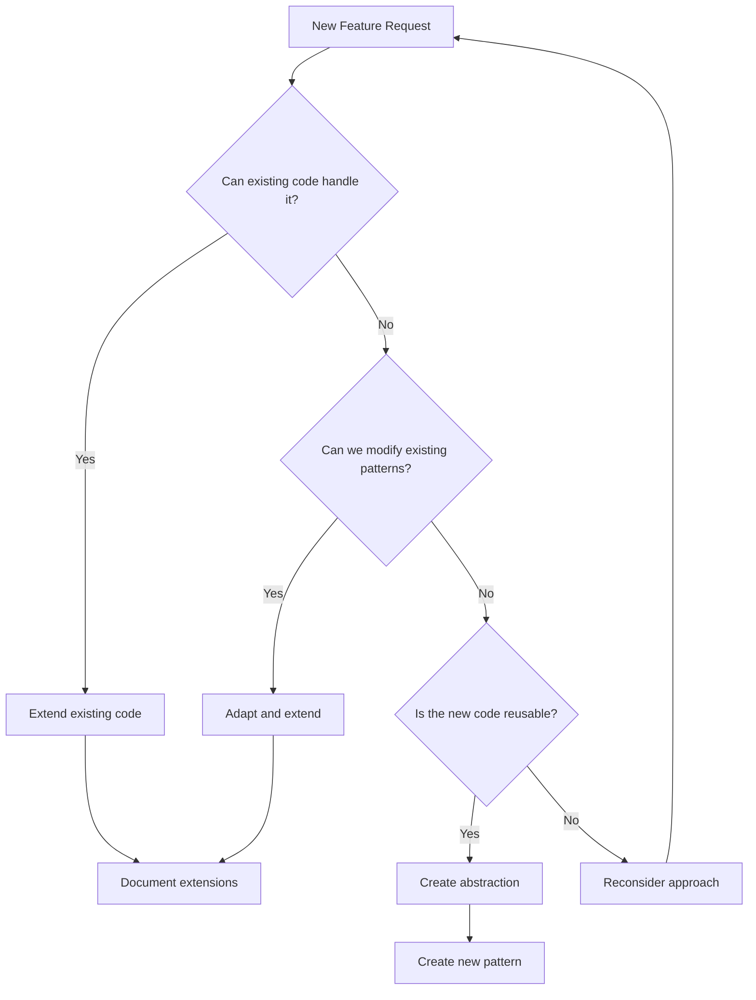

# Code Optimization Principles & Extended Thinking Framework

## Overview

This document establishes optimization principles based on successful patterns from our codebase, particularly the 87% code reduction achieved in the trial user upgrade flow optimization. These principles leverage extended thinking methodologies to ensure thorough analysis before implementation.

## Core Philosophy

> "The best code is no code. The second best code is code that already exists and works."

### The LEVER Framework

**L**everage existing patterns  
**E**xtend before creating  
**V**erify through reactivity  
**E**liminate duplication  
**R**educe complexity  

## 🧠 Extended Thinking Process

Based on [Anthropic's Extended Thinking methodology](https://docs.anthropic.com/en/docs/build-with-claude/extended-thinking), always follow this decision tree:



## 📋 Pre-Implementation Checklist

Before writing any code, complete this extended thinking exercise:

### 1. Pattern Recognition Phase (10-15 minutes)
```markdown
## Existing Pattern Analysis
- [ ] What similar functionality already exists?
- [ ] Which queries/mutations handle related data?
- [ ] What UI components display similar information?
- [ ] Which hooks manage related state?

## Code Reuse Opportunities
- [ ] Can I extend an existing table instead of creating a new one?
- [ ] Can I add fields to an existing query return?
- [ ] Can I enhance an existing hook with new computed properties?
- [ ] Can I modify an existing component with conditional rendering?
```

### 2. Complexity Assessment (5-10 minutes)
```markdown
## Proposed Solution Complexity
- Lines of new code: ___
- New files created: ___
- New database tables: ___
- New API endpoints: ___

## Optimized Alternative
- Lines extending existing code: ___
- Files modified: ___
- Fields added to existing tables: ___
- Existing endpoints enhanced: ___

If optimized < 50% of proposed, proceed with optimization.
```

## 🏗️ Architecture Principles

### 1. Database Schema Extensions

#### ❌ Anti-Pattern: Creating New Tables
```typescript
// DON'T: Create separate tracking table
campaignTracking: defineTable({
  userId: v.id('users'),
  source: v.string(),
  medium: v.string(),
  // ... 10 more fields
})

// Requires joins, separate queries, sync logic
```

#### ✅ Pattern: Extend Existing Tables
```typescript
// DO: Add fields to users table
users: defineTable({
  // ... existing fields ...
  
  // Campaign tracking (minimal additions)
  campaignSource: v.optional(v.string()),
  inviteCodeUsed: v.optional(v.string()),
})
// Data locality, no joins, existing indexes work
```

### 2. Query Optimization

#### ❌ Anti-Pattern: Duplicate Query Logic
```typescript
// DON'T: Create similar queries
export const getTrialUsers = query({ /* ... */ })
export const getActiveTrials = query({ /* ... */ })
export const getExpiringTrials = query({ /* ... */ })
```

#### ✅ Pattern: Extend Existing Queries
```typescript
// DO: Add to getUserStatus
export const getUserStatus = query({
  handler: async (ctx) => {
    // ... existing logic ...
    return {
      // ... existing fields ...
      // Just add what's needed
      isTrialFromCampaign: Boolean(user?.campaignSource),
      trialDaysRemaining: calculateDaysRemaining(user),
    }
  }
})
```

### 3. Frontend State Management

#### ❌ Anti-Pattern: New Hooks for Similar Data
```typescript
// DON'T: Create overlapping hooks
export function useTrialStatus() { /* ... */ }
export function useCampaignData() { /* ... */ }
export function useUserMetrics() { /* ... */ }
```

#### ✅ Pattern: Enhance Existing Hooks
```typescript
// DO: Extend useSubscription
export function useSubscription() {
  const userStatus = useQuery(api.users.getUserStatus)
  
  // Add computed properties for new features
  const enhancedData = useMemo(() => ({
    ...userStatus,
    // New campaign-aware properties
    shouldShowTrialOffer: userStatus?.isTrialing && userStatus?.daysRemaining <= 3,
    campaignEffectiveness: calculateCampaignROI(userStatus),
  }), [userStatus])
  
  return enhancedData
}
```

## 🔄 Convex-Specific Optimizations

### 1. Leverage Reactivity

```typescript
// ❌ DON'T: Manual state synchronization
const [userData, setUserData] = useState()
const [trialData, setTrialData] = useState()

useEffect(() => {
  // Polling or manual updates
}, [])

// ✅ DO: Let Convex handle reactivity
const userStatus = useQuery(api.users.getUserStatus)
// Automatically updates everywhere when data changes
```

### 2. Use Internal/Public Function Split

```typescript
// Public API (client-accessible)
export const getUserData = query({
  handler: async (ctx) => {
    // Return only what client needs
  }
})

// Internal operations (server-only)
export const updateSensitiveData = internalMutation({
  handler: async (ctx, args) => {
    // Secure operations
  }
})
```

### 3. Optimize Index Usage

```typescript
// ❌ DON'T: Create redundant indexes
.index('by_campaign', ['campaignSource'])
.index('by_trial_status', ['subscriptionStatus'])
.index('by_campaign_and_status', ['campaignSource', 'subscriptionStatus'])

// ✅ DO: Reuse existing indexes with filters
const trials = await ctx.db
  .query('users')
  .withIndex('by_subscription_status', q => q.eq('subscriptionStatus', 'trialing'))
  .filter(q => q.neq(q.field('campaignSource'), undefined))
  .collect()
```

## 📊 Decision Framework

### When to Extend vs Create New

Use this scoring system (inspired by [Extended Thinking with Tool Use](https://github.com/anthropics/anthropic-cookbook/blob/main/extended_thinking/extended_thinking_with_tool_use.ipynb)):

| Criteria | Extend Existing | Create New |
|----------|----------------|------------|
| Similar data structure exists | +3 points | -3 points |
| Can reuse existing indexes | +2 points | -2 points |
| Existing queries return related data | +3 points | -3 points |
| UI components show similar info | +2 points | -2 points |
| Would require <50 lines to extend | +3 points | -3 points |
| Would introduce circular dependencies | -5 points | +5 points |
| Significantly different domain | -3 points | +3 points |

**Score > 5**: Extend existing code  
**Score < -5**: Create new implementation  
**Score -5 to 5**: Deeper analysis required  

## 🛠️ Implementation Strategies

### 1. The Three-Pass Approach

Inspired by [Extended Thinking Tips](https://docs.anthropic.com/en/docs/build-with-claude/prompt-engineering/extended-thinking-tips):

**Pass 1: Discovery (No Code)**
- Find all related existing code
- Document current patterns
- Identify extension points

**Pass 2: Design (Minimal Code)**
- Write interface changes only
- Update type definitions
- Plan data flow

**Pass 3: Implementation (Optimized Code)**
- Implement with maximum reuse
- Add only essential new logic
- Document why choices were made

### 2. Code Reuse Patterns

#### Pattern: Feature Flags in Existing Components
```typescript
// Instead of new component
export function SubscriptionStatus() {
  const { userStatus, campaignData } = useSubscription()
  
  return (
    <>
      {/* Existing UI */}
      
      {/* Conditionally show new features */}
      {campaignData?.isTrialFromCampaign && (
        <CampaignBadge source={campaignData.source} />
      )}
    </>
  )
}
```

#### Pattern: Computed Properties
```typescript
// Instead of new queries
export const getUserStatus = query({
  handler: async (ctx) => {
    const user = await getUser(ctx)
    
    // Compute new properties from existing data
    return {
      ...user,
      // Derived campaign metrics
      campaignConversionValue: user.subscriptionTier 
        ? prices[user.subscriptionTier] * 12 
        : 0,
      isHighValueTrial: user.subscriptionTier === 'creator' && user.isTrialing,
    }
  }
})
```

## 📈 Real-World Example: Trial Flow Optimization

### Before Optimization (1050 lines)
```typescript
// 4 new tables
// 10+ new queries  
// 5+ new components
// Complex state management
// Manual sync logic
```

### After Optimization (140 lines)
```typescript
// Extended 2 existing tables (+11 fields)
// Extended 1 query (getUserStatus)
// Extended 1 hook (useSubscription)
// Leveraged Convex reactivity
// No sync logic needed
```

**Result**: 87% code reduction, better performance, easier maintenance

## ⚡ Performance Optimization Rules

### 1. Query Efficiency
```typescript
// ❌ Multiple queries
const user = useQuery(api.users.getUser)
const subscription = useQuery(api.subscriptions.getSubscription)
const usage = useQuery(api.usage.getUsage)

// ✅ Single query returning all data
const userStatus = useQuery(api.users.getUserStatus)
// Returns user + subscription + usage in one call
```

### 2. Index Optimization
```typescript
// Use existing indexes with filters instead of new indexes
.withIndex('by_subscription_status', q => q.eq('subscriptionStatus', 'trialing'))
.filter(q => q.neq(q.field('campaignSource'), undefined))
```

### 3. Batch Operations
```typescript
// ❌ Sequential operations
for (const item of items) {
  await ctx.db.patch(item._id, updates)
}

// ✅ Batch when possible
const promises = items.map(item => 
  ctx.db.patch(item._id, updates)
)
await Promise.all(promises)
```

## 🚫 Anti-Patterns to Avoid

### 1. The "Just One More Table" Trap
Each new table adds:
- Schema complexity
- Join requirements  
- Sync challenges
- Migration overhead

**Ask**: Can this data live in an existing table?

### 2. The "Similar But Different" Excuse
Before creating `getUserTrialStatus` when `getUserStatus` exists:
- Can getUserStatus return trial fields?
- Can we add a `includeTrial` parameter?
- Can computed properties derive what we need?

### 3. The "UI Drives Database" Mistake
Never create database structure to match UI components. Instead:
- Store data in its most logical form
- Use queries to transform for UI
- Let components compute display values

## 📝 Documentation Requirements

When extending existing code:

```typescript
// Document WHY you're extending
export const getUserStatus = query({
  handler: async (ctx) => {
    // ... existing implementation ...
    
    // OPTIMIZATION: Added campaign fields here instead of creating
    // separate campaignTracking table. Saves joins and maintains
    // data locality. See: trial-optimization-2025-07-01
    
    return {
      // ... existing fields ...
      campaignSource: user?.campaignSource,
      inviteCodeUsed: user?.inviteCodeUsed,
    }
  }
})
```

## 🎯 Success Metrics

Track optimization success:

| Metric | Target |
|--------|--------|
| Code reduction vs initial approach | >50% |
| Reused existing patterns | >70% |
| New files created | <3 per feature |
| New database tables | 0 (extend existing) |
| Query complexity | No new indexes |
| Implementation time | <50% of estimate |

## 🔍 Review Checklist

Before submitting optimized code:

- [ ] Extended existing tables instead of creating new ones
- [ ] Reused existing queries with additions
- [ ] Leveraged existing hooks and components  
- [ ] No duplicate state management logic
- [ ] Documented why extensions were chosen
- [ ] Maintained backward compatibility
- [ ] Added fields are optional (v.optional)
- [ ] No circular dependencies introduced
- [ ] Performance same or better
- [ ] Code reduction >50%

## 📚 References

- [Extended Thinking Documentation](https://docs.anthropic.com/en/docs/build-with-claude/extended-thinking)
- [Extended Thinking Tips](https://docs.anthropic.com/en/docs/build-with-claude/prompt-engineering/extended-thinking-tips)
- [Convex Best Practices](.cursor/rules/convex_rules.mdc)
- [Trial Optimization Case Study](./08-plans/2025-07-01-optimization-summary.md)

---

*Remember: Every line of code is a liability. The best feature is one that requires no new code, just better use of what exists.*